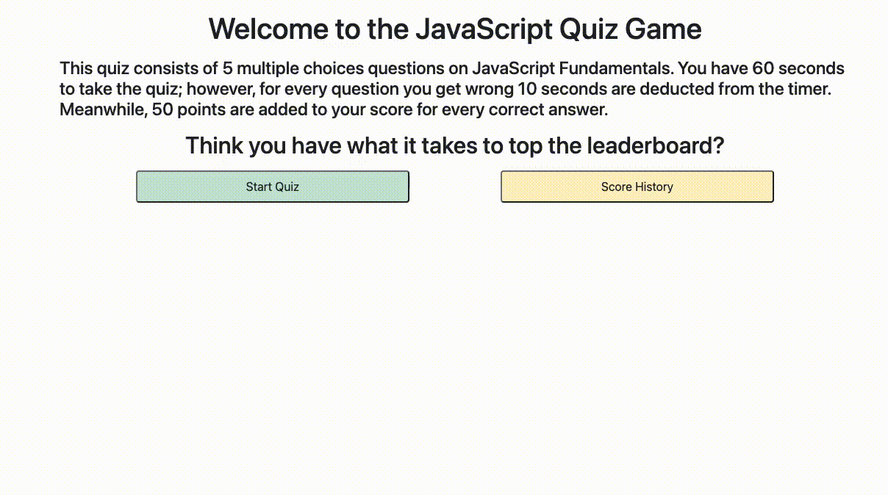

# Homework 4 - Quiz Game

## Description

For Homework 4 of the DU coding bootcamp I was tasked with creating a multiple choice quiz game using JavaScript. The home screen for the user shows a welcome message with the rules for the quiz and options to either start the quiz or show score history. Once the user selects to start the quiz a 60 second timer and an iteration of 5 questions is shown. After the user selects each answer, it goes straight to the next question and underneath shows a message of correct or incorrect. Once the quiz is over the user has the option to input their name and once they do so, are directed to the show score history page, updated with their most recent score.

This assignment helped me to learn a lot about controlling the elements of and HTML page using JavaScript. I had to use pretty much every skill we learned during these unit, including event listeners on click events, storing users inputs as variables, storing and rendering items in local storage, iterating across an array containing objects, which required calling object values by index number, and inline CSS styling.

This assignment helped me to work on my debugging skills because I had a lot of issues arise along the way. One of the trickier ones was click events firing multiple times, and when I searched about it on the web all the answers were pertaining to jQuery. Finally I figured out that I had to remove the event listener within the function the event listener was calling on with the click event. Another tricky issues I had was with rendering the scores to the screen. The first time worked alright, but each subsequent append added all of the previous scores as well as the most recent to the end of the array, leading to extra scores on the screen that weren't generated on user stories. In the end the solution was to set the textContent of the high score list equal to an empty string within the renderSCores function. The morale of the story from these two situations was that sometimes the most complex seeming bugs have the easiest of solutions: one simple line of code.

## Usage

If you would like to be able to try the quiz out for yourself, you can access the website at the following link: https://chighum.github.io/Homework4-Quiz_Game/

You can also what the deployed website looks like live in action below, answering incorrectly in order to show the different changes to the timer element:

